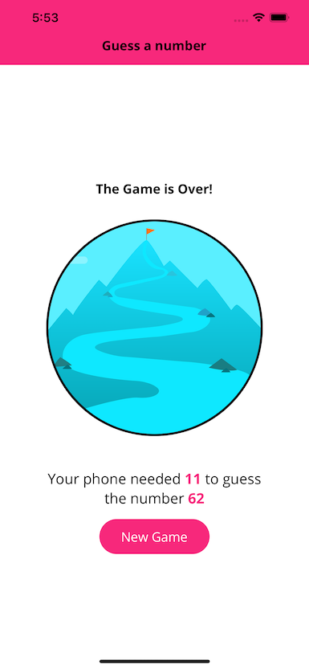

# Number Guessing Game

This is a game that enables a user to enter a number, and the application will guess a number that is higher or lower depending on user feedback.

Specific focus on this app involved learning styling, how styling differers between components(Eg `<Text>` inherits styles, while `<View>` does not), creation of custom components, the use of custom fonts and images, and creating shared constants across components.

# Execution
This app uses Expo, the application can be ran with `expo start`

# Screenshots

